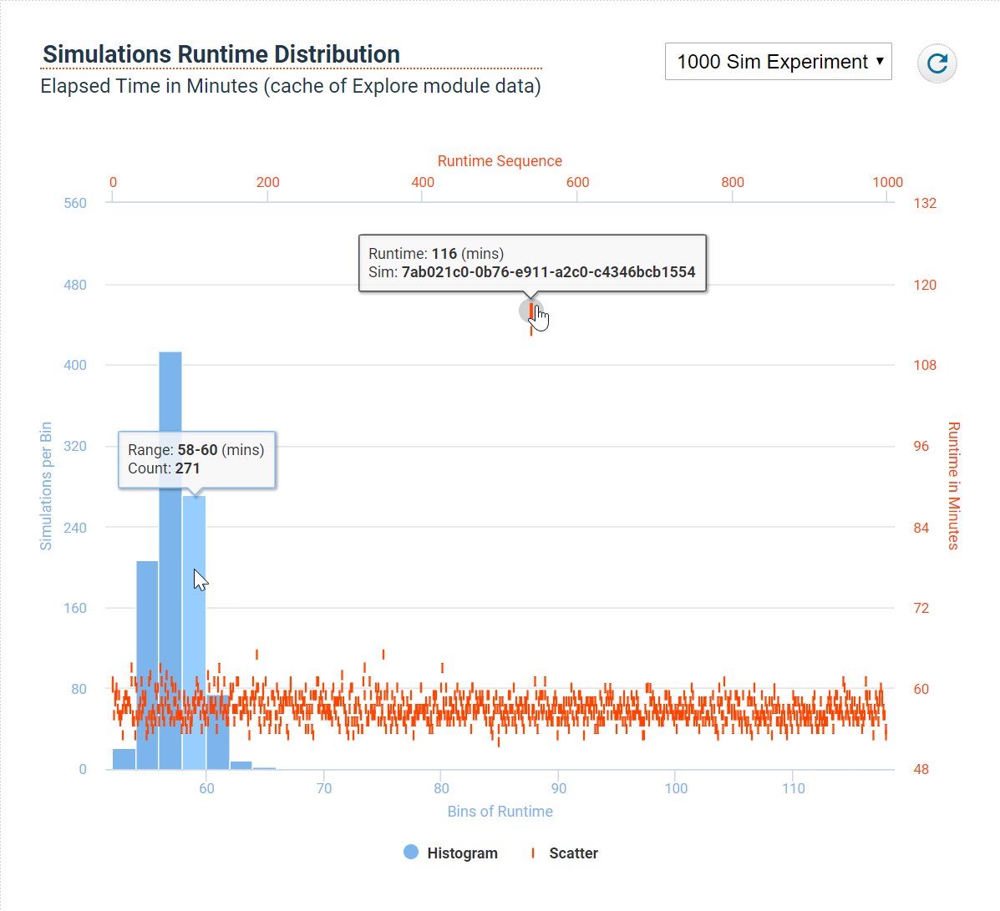

###### This is pre-release software.
# Demo of Simulations Runtime Distribution

The purpose of this demonstration is to explore possibilities of charting Simulation Runtimes. Run this demonstration in a web browser. A web server (or localhost) is required for demonstrating complete functionality. The code here references dependencies via a relative path, so it is recommended to run this entire repository intact. See below for instructions.

***

***

### Running this Demo
This example demonstrates integration into a minimal [ES6-compliant](http://es6-features.org/) project bundled by the [Webpack](https://webpack.js.org/) library. An enclosed `package.json` designates all dependencies required for running the demonstration. Note: This example may not work as expected in the Internet Explorer browser.

>*The [data files](build/data/) used here were captured from a cache and massaged as needed. No REST API is currently available to request this data directly.*

[NodeJS](https://nodejs.org/en/download/) is a technology which can execute scripts on a computer. In this application, NodeJS fasciliates the Webpack framework in assembling the various ingredients of the Client code, preparing them for deployment to a browser. It will be necessary to install NodeJS to run these examples.

The Node Package Manager ([NPM](https://www.npmjs.com/get-npm)) is installed as a component of NodeJS and is a popular means for executing the `package.json` of a project.

**1:** From a command prompt, navigate to the project path where the clone of this repository is installed. A `package.json` file should exist at this path.
```sh
> cd C:\path\to\this\project\folder
```
**2:** From a command prompt, run the NPM `install` command to get the dependencies as prescribed in the `package.json` file. This will create a path local to this project `\node_modules` for deposit of the downloaded code. There may be a considerable number of dependencies, so this process could take a minute or so.
```sh
> npm install
```
**3:** From a command prompt, run the NPM `start` command which has been configured in the `webpack.config.js` to instruct Webpack to survey the dependencies prescribed in the project code and then compile the bundled JavaScript.
```sh
> npm start
```
**4:** Open a browser and navigate to `http://localhost:8080` to view the deployed code. Note: If this does not work, there may be a conflict with other processes, so the `8080` port can be changed by [configuring the devServer](https://webpack.js.org/configuration/dev-server/) in [webpack.config.js](webpack.config.js).